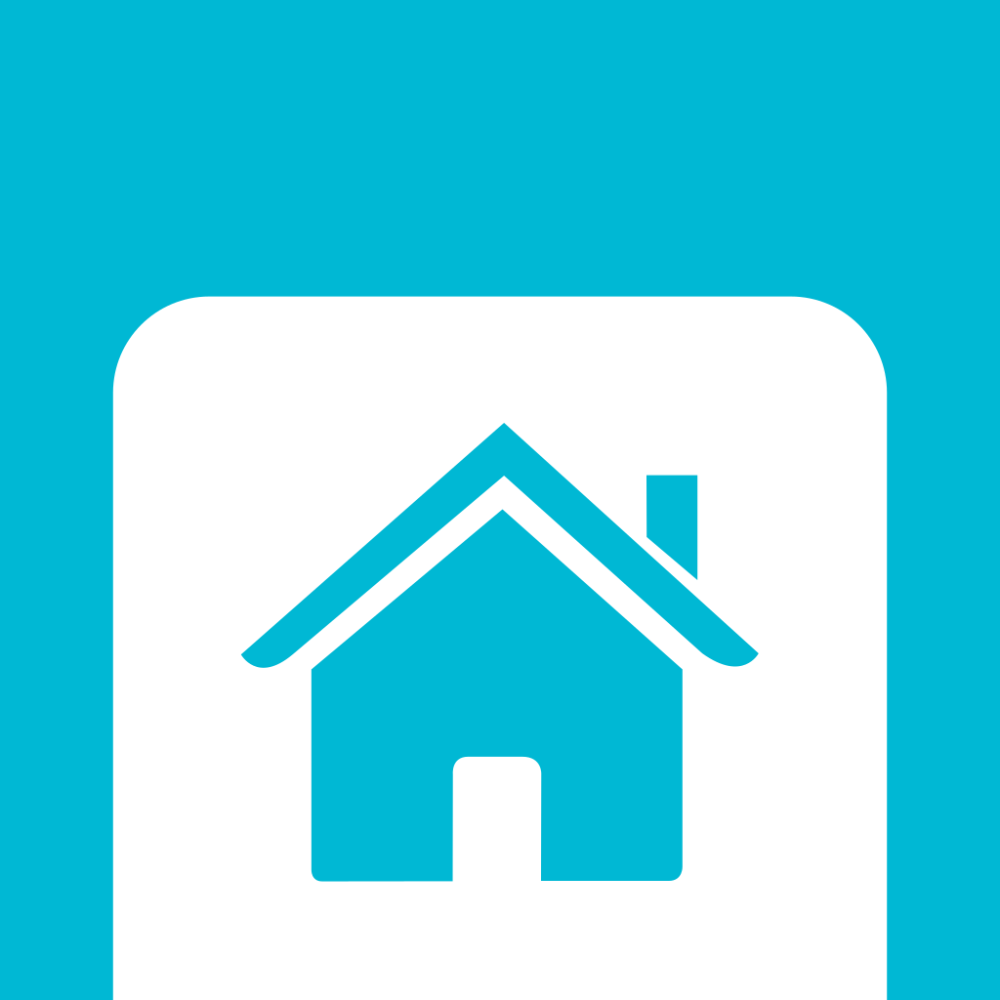

Home Slide for Home Assistant
=============================
[](https://app.bitrise.io/app/559f3465686f9092)

[](https://github.com/outadoc/home-slide-android/blob/develop/LICENSE)



Home Slide is an Android app for Home Assistant users that allows them to control their devices as easily as possible, *à la* HomeKit controls on iOS.

It's available for phones, tablets, and Wear OS devices.

<a href='https://play.google.com/store/apps/details?id=fr.outadoc.quickhass&pcampaignid=pcampaignidMKT-Other-global-all-co-prtnr-py-PartBadge-Mar2515-1'></a>

Features
--------
- Wear OS support
- Easy OAuth configuration
- Simple toggles for your devices

- Easy access from anywhere
  - Quick settings tile
  - Android 11 power menu integration
  - Can be set as your assistant

Support the project
-------------------
<a href="https://www.buymeacoffee.com/outadoc" target="_blank"></a>

License
-------
```
Copyright (C) 2019-2021 Baptiste Candellier.

Licensed under the Apache License, Version 2.0 (the "License");
you may not use this file except in compliance with the License.
You may obtain a copy of the License at

    http://www.apache.org/licenses/LICENSE-2.0

Unless required by applicable law or agreed to in writing, software
distributed under the License is distributed on an "AS IS" BASIS,
WITHOUT WARRANTIES OR CONDITIONS OF ANY KIND, either express or implied.
See the License for the specific language governing permissions and
limitations under the License.
```
